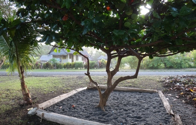

# Multi-CAST Matukar Panau

## How to cite

If you use these data please cite
- the original source
  > Barth, Danielle & Davey, Kira & Matheas, Maria. 2023. Multi-CAST Matukar Panau. In Haig, Geoffrey & Schnell, Stefan (eds.), Multi-CAST: Multilingual corpus of annotated spoken texts. Version 2311. Bamberg: University of Bamberg. (multicast.aspra.uni-bamberg.de/#matukar) (date accessed)
- the derived dataset using the DOI of the [particular released version](../../releases/) you were using



## Description


**Matukar Panau** is a highly endangered Oceanic language spoken around 45 km north of Madang, Papua New Guinea. Although most children are no longer learning Matukar Panau, current speakers (approximately 300) form a vibrant community of multilinguals in dense social networks. As an Oceanic language on the Papua New Guinea coast, Matukar Panau has many interesting Papuan features.

The Multi-CAST Matukar Panau corpus constitutes a small subset of recordings made by Danielle Barth during her fieldwork between 2010–2020 (Australian National University Asia-Pacific Innovation Program Grant, *Resolving Ambiguity: What face-to-face communication can contribute*, PI: Danielle Barth); language documentation is ongoing. Data has been transcribed and translated with help from local community members, especially Kadagoi Rawad Forepiso and Rudolf Raward. Recordings can be found in the [ELAR](http://hdl.handle.net/2196/00-0000-0000-0012-388F-3) and PARADISEC ([1](http://catalog.paradisec.org.au/collections/DGB1), [2](http://catalog.paradisec.org.au/collections/SocCog)) archives. More information and resources on the language can be found on the [project website](https://matukar.wordpress.com/).

The texts in Multi-CAST were glossed with GRAID and RefIND by Danielle Barth, Kira Davey, and Maria Matheas. In addition to monologue narratives, some stimulus-based conversational descriptions have also been annotated with these schemata to enable research about referent expression when describing familiar and unfamiliar objects, places, and people. Recordings of these events are archived in ELAR and PARADISEC and those archives will eventually also provide open access to ELAN files with the annotations.

This dataset is licensed under a CC-BY-4.0 license

Available online at https://multicast.aspra.uni-bamberg.de/#matukar


```geojson
{
    "type": "FeatureCollection",
    "features": [
        {
            "type": "Feature",
            "geometry": {
                "type": "Point",
                "coordinates": [
                    145.779,
                    -4.9078
                ]
            }
        },
        {
            "type": "Feature",
            "geometry": {
                "type": "Polygon",
                "coordinates": [
                    [
                        [
                            140.779,
                            0.09220000000000006
                        ],
                        [
                            150.779,
                            0.09220000000000006
                        ],
                        [
                            150.779,
                            -9.9078
                        ],
                        [
                            140.779,
                            -9.9078
                        ],
                        [
                            140.779,
                            0.09220000000000006
                        ]
                    ]
                ]
            }
        }
    ]
}
```


## Corpus counts

Only a small number of basic GRAID symbols are counted:

*Function symbols*
- ⟨0⟩ zero
- ⟨pro⟩ definite pronoun
- ⟨np⟩ full noun phrase
- ⟨other⟩ form not further specified

*Person/Animacy symbols*
- ⟨.1⟩ first person
- ⟨.2⟩ second person
- ⟨.h⟩ third person, human
- ⟨.d⟩ third person, anthropomorphic
- ø third person, non-human

*Function symbols*
- ⟨:s⟩ subject of an intransitive clause
- ⟨:a⟩ subject of a transitive clause
- ⟨:ncs⟩ non-canonical subject
- ⟨:p⟩ direct object
- ⟨:obl⟩ oblique argument
- ⟨:g⟩ goal argument
- ⟨:l⟩ locational argument
- ⟨:pred⟩ predicate
- ⟨:poss⟩ possessive
- ⟨:other⟩ function not further specified

Only basic categories are listed; categories represented by complex symbols with additional
specifiers (e.g. ⟨dem_pro⟩ ‘demonstrative pronoun’) have been subsumed under the more basic
category (e.g. ⟨pro⟩ ‘definite pronoun’). Please refer to the annotation notes for this corpus for
information on all annotated categories, including those not listed here.

| GRAID | ⟨:s⟩ | ⟨:a⟩ | ⟨:ncs⟩ | ⟨:p⟩ | ⟨:obl⟩ | ⟨:g⟩ | ⟨:l⟩ | ⟨:pred⟩ | ⟨:poss⟩ | ⟨:other⟩ | totals |
|:--------------|-------:|-------:|---------:|-------:|---------:|-------:|-------:|----------:|----------:|-----------:|---------:|
| **⟨0.1⟩** | 221 | 131 | 0 | 21 | 0 | 8 | 0 | 0 | 0 | 0 | 381 |
| **⟨0.2⟩** | 16 | 76 | 0 | 4 | 0 | 3 | 0 | 0 | 0 | 0 | 99 |
| **⟨0.h⟩** | 173 | 233 | 0 | 65 | 0 | 17 | 0 | 0 | 0 | 0 | 488 |
| **⟨0.d⟩** | 0 | 0 | 0 | 0 | 0 | 0 | 0 | 0 | 0 | 0 | 0 |
| **⟨0⟩** | 30 | 2 | 0 | 147 | 0 | 0 | 0 | 0 | 0 | 0 | 179 |
| **⟨pro.1⟩** | 41 | 17 | 0 | 0 | 3 | 1 | 0 | 0 | 81 | 0 | 143 |
| **⟨pro.2⟩** | 13 | 8 | 0 | 0 | 0 | 1 | 0 | 0 | 6 | 0 | 28 |
| **⟨pro.h⟩** | 66 | 27 | 0 | 0 | 1 | 0 | 0 | 0 | 34 | 0 | 128 |
| **⟨pro.d⟩** | 0 | 0 | 0 | 0 | 0 | 0 | 0 | 0 | 0 | 0 | 0 |
| **⟨pro⟩** | 28 | 1 | 0 | 9 | 1 | 0 | 1 | 1 | 3 | 0 | 44 |
| **⟨np.1⟩** | 0 | 0 | 0 | 1 | 0 | 0 | 0 | 0 | 0 | 0 | 1 |
| **⟨np.2⟩** | 0 | 0 | 0 | 0 | 0 | 0 | 0 | 0 | 0 | 0 | 0 |
| **⟨np.h⟩** | 107 | 37 | 0 | 55 | 8 | 12 | 0 | 3 | 4 | 5 | 231 |
| **⟨np.d⟩** | 0 | 0 | 0 | 0 | 0 | 0 | 0 | 0 | 0 | 0 | 0 |
| **⟨np⟩** | 124 | 6 | 0 | 246 | 22 | 107 | 97 | 75 | 0 | 62 | 739 |
| **⟨other.1⟩** | 0 | 0 | 0 | 0 | 0 | 0 | 0 | 0 | 0 | 0 | 0 |
| **⟨other.2⟩** | 0 | 0 | 0 | 0 | 0 | 0 | 0 | 0 | 0 | 0 | 0 |
| **⟨other.h⟩** | 0 | 0 | 0 | 0 | 0 | 0 | 0 | 0 | 0 | 0 | 0 |
| **⟨other.d⟩** | 0 | 0 | 0 | 0 | 0 | 0 | 0 | 0 | 0 | 0 | 0 |
| **⟨other⟩** | 2 | 3 | 0 | 7 | 0 | 1 | 60 | 20 | 0 | 0 | 93 |
| | 821 | 541 | 0 | 555 | 35 | 150 | 158 | 99 | 128 | 67 | 2554 |


**Clause boundaries**

| GRAID | count |
|:-----------|--------:|
| **⟨##⟩** | 0 |
| **⟨#⟩** | 1423 |
| **totals** | 1423 |


## Corpus metadata

- [Translated texts](cldf/media/translated-texts.pdf)


## CLDF Datasets

The following CLDF datasets are available in [cldf](cldf):

- CLDF [TextCorpus](https://github.com/cldf/cldf/tree/master/modules/TextCorpus) at [cldf/TextCorpus-metadata.json](cldf/TextCorpus-metadata.json)